# Configurar e gerenciar suas fontes da IA de conteúdo

Este guia aborda a configuração de Fontes de IA de conteúdo no Cloud Manager, desde o cumprimento dos pré-requisitos até a criação de uma fonte de conteúdo e a confirmação de que ela está indexada e disponível.

## Pré-requisitos {#prerequisites}

Antes de começar, verifique se as seguintes condições foram atendidas:

* Você tem um programa ativo do Cloud Manager com pelo menos um ambiente do AEM as a Cloud Service.
* Seu usuário está atribuído ao perfil de produto **Usuários do AEM** para o ambiente de destino, que permite ao usuário exibir fontes de conteúdo.
* Seu usuário está atribuído ao perfil de produto **Administradores do AEM** para o ambiente de destino, que permite ao usuário criar e editar fontes de conteúdo. O acesso ao Cloud Manager não é suficiente - consulte [Atribuir um usuário a um perfil de produto do AEM](#assign-product-profile) abaixo.
* O perfil de produto do ambiente foi provisionado em **Adobe Admin Console**.

## Atribuir um usuário a um perfil de produto do AEM {#assign-product-profile}

Use este procedimento para conceder a um usuário acesso ao [!DNL Adobe Experience Manager] as a Cloud Service para um ambiente específico. Atribua o perfil que corresponda ao acesso de que o usuário precisa:

* **[!UICONTROL Usuários do AEM]** - exibir fontes de conteúdo.
* **[!UICONTROL Administradores do AEM]** - crie e edite fontes de conteúdo.

>[!NOTE]
>
>Os usuários devem pertencer a um perfil de produto do AEM, como **[!UICONTROL Usuários do AEM]** ou **[!UICONTROL Administradores do AEM]**, para acessar o AEM. O acesso ao Cloud Manager não é suficiente.

Para atribuir esses perfis, você deve ser um administrador do sistema com o perfil de produto [!UICONTROL Proprietário da empresa] do Cloud Manager. Tenha o nome do usuário e o endereço de email prontos.

1. Em [Cloud Manager](https://my.cloudmanager.adobe.com/), navegue até o seu programa e selecione **[!UICONTROL Gerenciar Acesso]** para o ambiente de destino. Uma nova guia abre [!DNL Adobe Admin Console] para esse ambiente.
1. Selecione o perfil de produto **[!UICONTROL Usuários do AEM]** ou **[!UICONTROL Administradores do AEM]** para a camada **publicar** - por exemplo, `AEM Administrators - publish - Program 12345 - Environment 67890`. A IA de conteúdo indexa o conteúdo publicado, portanto, o perfil deve ser atribuído no nível de publicação, não no de criação.
1. Selecione **[!UICONTROL Adicionar Usuário]**.
1. Insira o nome do usuário e o endereço de email e salve a alteração. O usuário é adicionado ao perfil do produto.

Repita essas etapas para cada ambiente em que o usuário precisa de acesso, como desenvolvimento, armazenamento temporário ou produção.

>[!CAUTION]
>
>Não edite nem exclua os perfis de produto padrão denominados **[!UICONTROL Administradores do AEM]** ou **[!UICONTROL Usuários do AEM]**. Renomear **[!UICONTROL Administradores do AEM]** remove os direitos de administrador de todos os atribuídos a ele.

### Verificar a atribuição {#verify-assignment}

Para verificar se a atribuição foi bem-sucedida:

1. No [!DNL Admin Console], reabra o perfil de produto atribuído.
1. Confirme se o usuário aparece na lista de membros.

Se estiver solucionando problemas de acesso ou token, confirme se o usuário foi adicionado diretamente ao perfil do produto e não somente por meio de um grupo.

## Etapa 1 - Abrir a guia Configuração da IA de conteúdo {#open-tab}

1. Faça logon no [Cloud Manager](https://my.cloudmanager.adobe.com/) e selecione seu programa.

   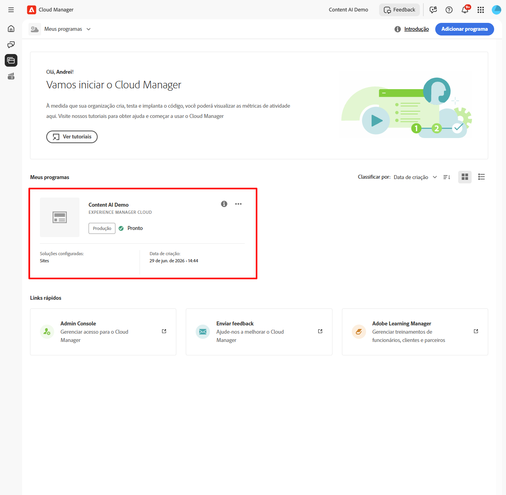

1. Na **[!UICONTROL Visão geral do programa]**, localize a seção **[!UICONTROL Ambientes]** e selecione o ambiente que deseja configurar.

   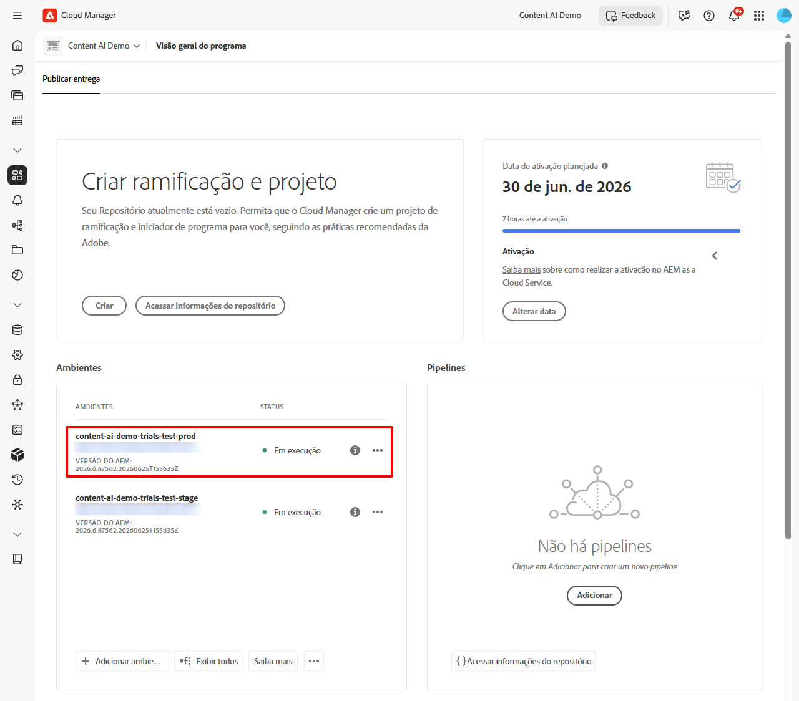

1. Na página de detalhes do ambiente, selecione a guia **[!UICONTROL Configuração da IA de conteúdo]**.

   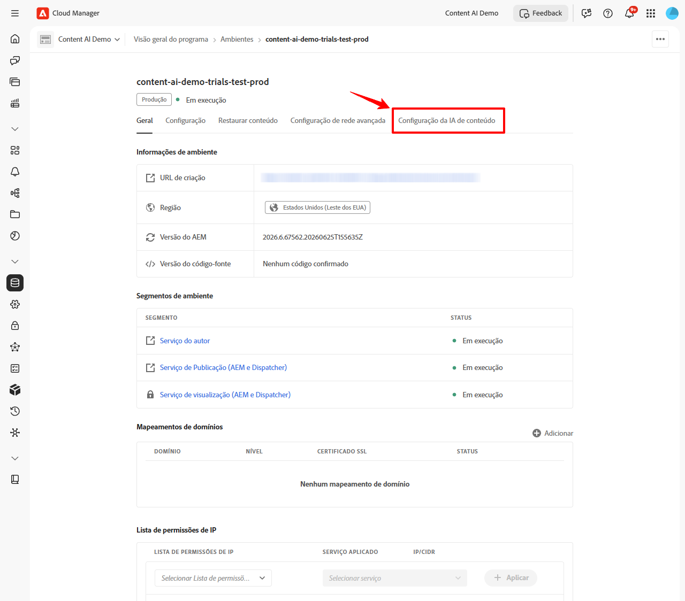

## Etapa 2 - Criar uma fonte de IA de conteúdo {#create-source}

Uma fonte de conteúdo define o site que a IA de conteúdo rastreia e indexa.

1. Na guia **[!UICONTROL Configuração da IA de conteúdo]**, selecione **[!UICONTROL Criar fonte]**.

   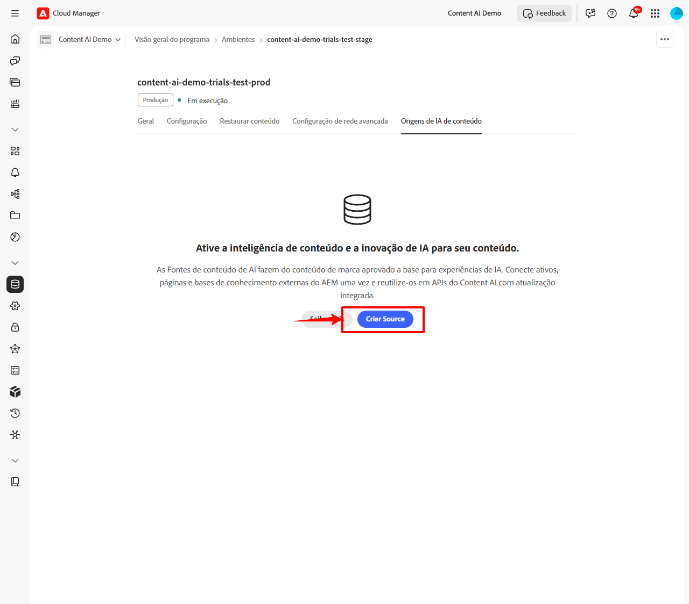

1. Na caixa de diálogo **[!UICONTROL Criar/adicionar nova fonte da IA de conteúdo]**, preencha os campos:

   | Texto | Descrição |
   | --- | --- |
   | **[!UICONTROL Nome da configuração da IA de conteúdo]** | Um identificador exclusivo para esta fonte (por exemplo, `my-site-index`). Não pode ser alterado após a criação. |
   | **[!UICONTROL Descrição]** | *(Opcional)* Uma breve descrição da fonte de conteúdo. |
   | **[!UICONTROL Endereço do site]** | A URL raiz do site a ser rastreado (por exemplo, `https://www.example.com/`). |
   | **[!UICONTROL Excluir URLs]** | *(Opcional)* padrões de URL a serem ignorados durante o rastreamento. |
   | **[!UICONTROL Frequência de atualização]** | Com que frequência a IA de conteúdo rastreia novamente a fonte: semanalmente, diariamente, 4 vezes por dia, a cada 60 minutos ou a cada 15 minutos. |

   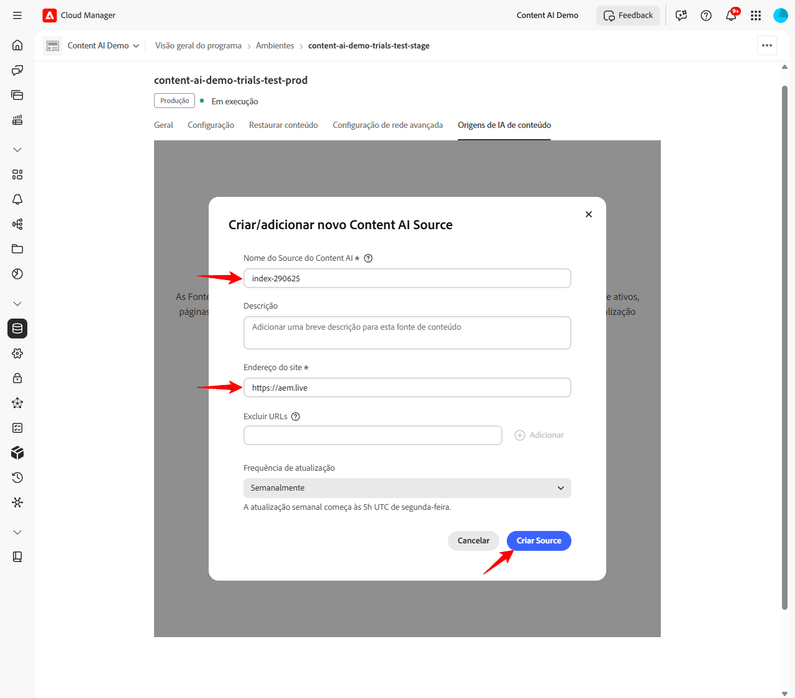

   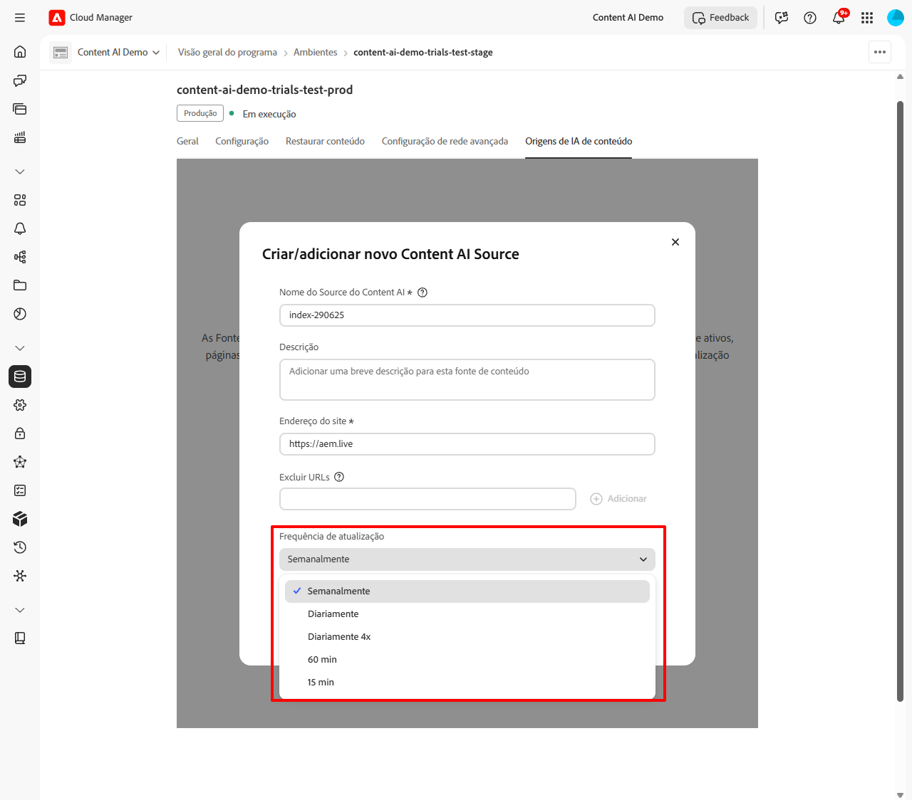

1. Selecione **[!UICONTROL Criar fonte]**. A aquisição é iniciada automaticamente, e a origem é movida para **Indexação**.

   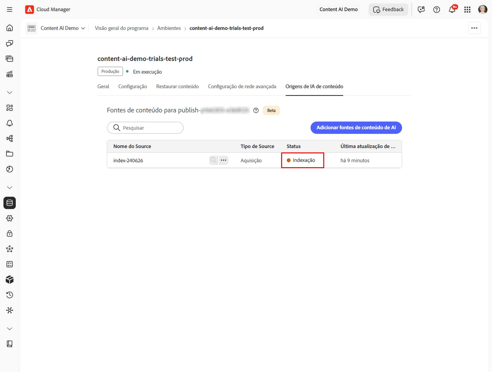

## Etapa 3 - Executar aquisição novamente {#trigger-acquisition}

A aquisição é executada automaticamente ao criar uma origem e, em seguida, no agendamento definido pela **[!UICONTROL Frequência de atualização]**. Você também pode acionar uma execução manual a qualquer momento - por exemplo, para reindexar imediatamente após a publicação de novo conteúdo.

1. Na lista de fontes, selecione o ícone **mais ações** (…) ao lado da sua fonte e, em seguida, selecione **[!UICONTROL Acionar aquisição]**.

   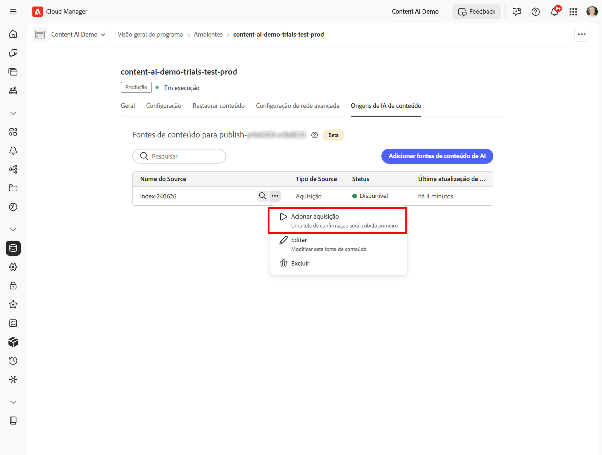

1. Na caixa de diálogo **[!UICONTROL Acionar aquisição]**, examine os detalhes da fonte - **[!UICONTROL Fonte de conteúdo]**, **[!UICONTROL Última execução]** e **[!UICONTROL Próxima execução agendada]** - e selecione **[!UICONTROL Acionar]**.

   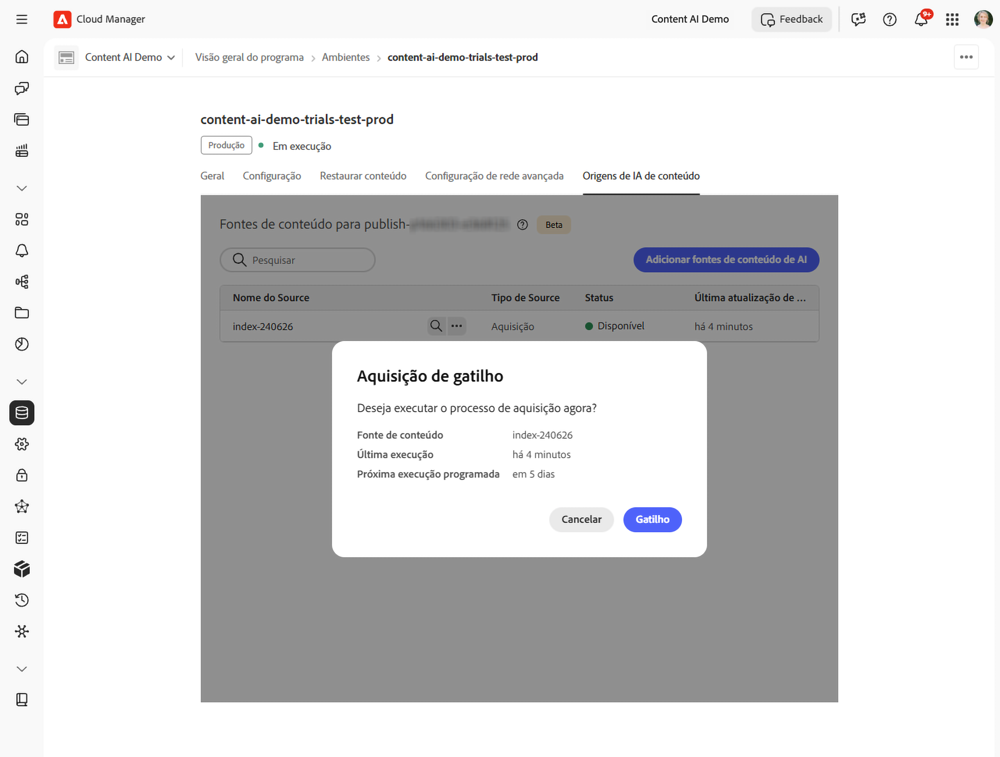

## Etapa 4 - Monitorar status de indexação {#monitor-status}

Após o início da aquisição, o status da fonte é atualizado em tempo real.

| Status | Significado |
| --- | --- |
| **Novo** | Source recém-criada; a aquisição automática ainda não começou. Este status é breve. |
| **Indexação** | Aquisição em andamento; o conteúdo está sendo rastreado e indexado. |
| **Disponível** | A indexação foi concluída; a fonte está pronta para atender às consultas de pesquisa. |

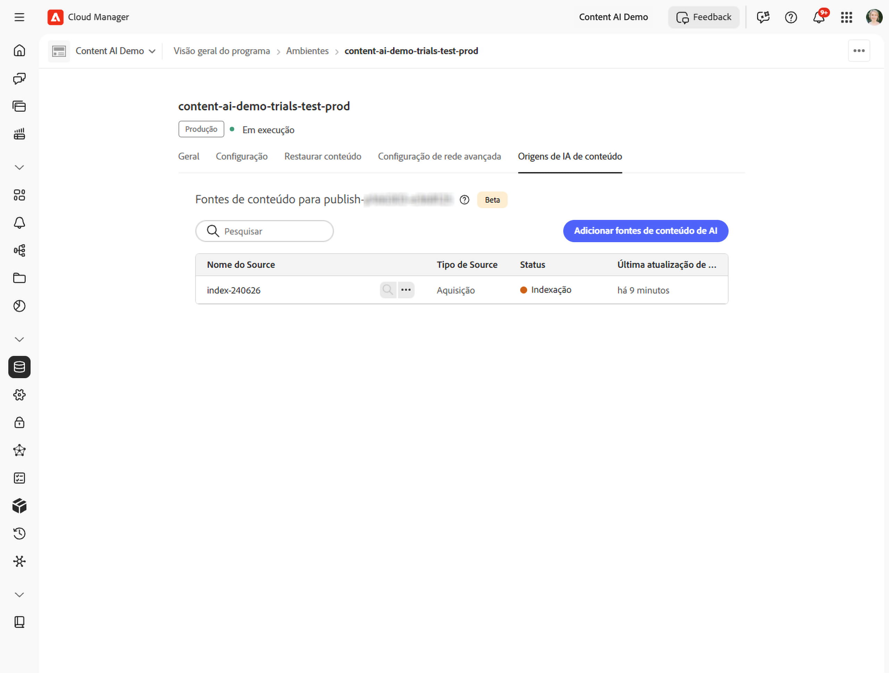

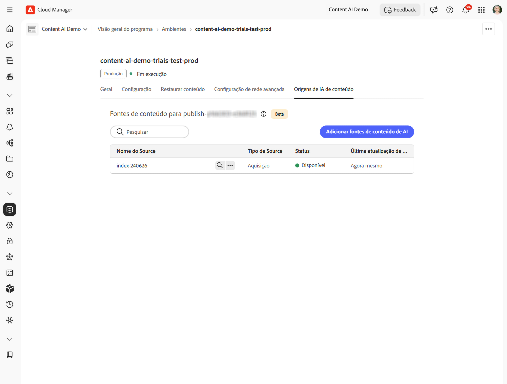

Aguarde até que o status passe para **Disponível** antes de pesquisar no índice ou testar a API.

## Etapa 5 - Pesquisar conteúdo indexado {#search-content}

Quando o status da fonte estiver **Disponível**, você poderá executar consultas de pesquisa diretamente do Cloud Manager para verificar se o conteúdo foi indexado corretamente.

1. Na lista de origem, selecione o ícone **pesquisar** (lupa) ao lado da origem.

   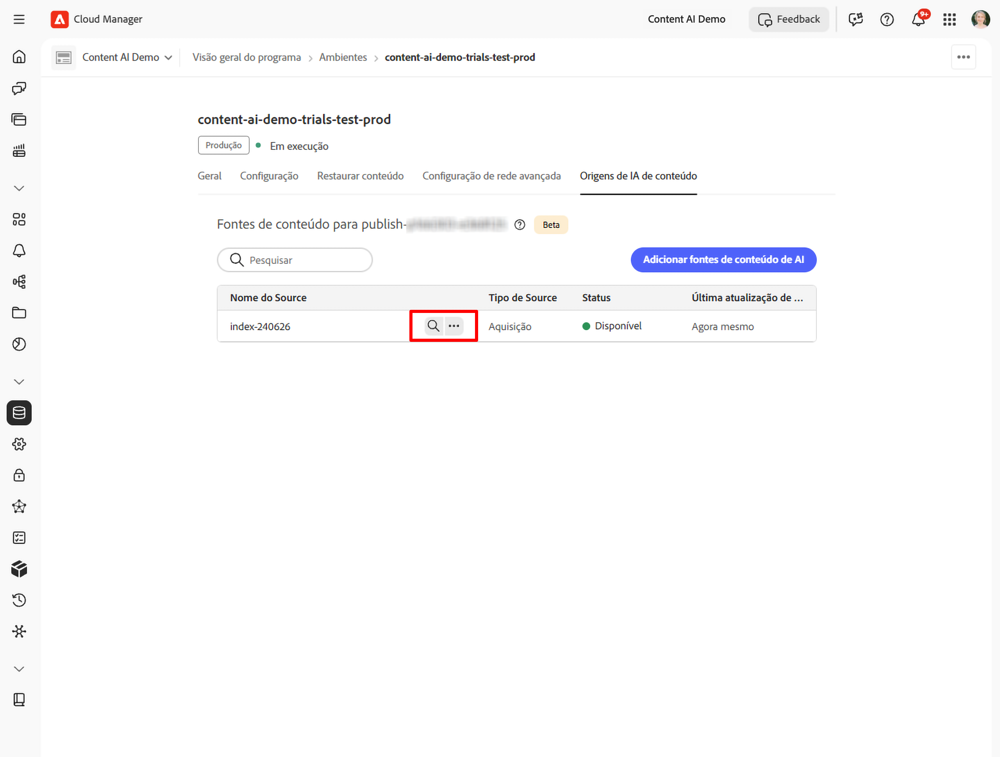

1. Insira uma consulta no campo de pesquisa. Os resultados mostram uma lista de itens correspondentes com pontuação de correspondência e tipo de conteúdo (por exemplo, **PÁGINA** ou **PDF**). Selecionar um resultado abre uma visualização à direita.

   

## Modificar ou excluir uma fonte {#modify-source}

### Modificar uma origem {#modify}

Para atualizar a configuração de uma fonte após criá-la:

1. Na lista de fontes, selecione o ícone **mais ações** (...) ao lado da fonte e selecione **[!UICONTROL Editar]**.

   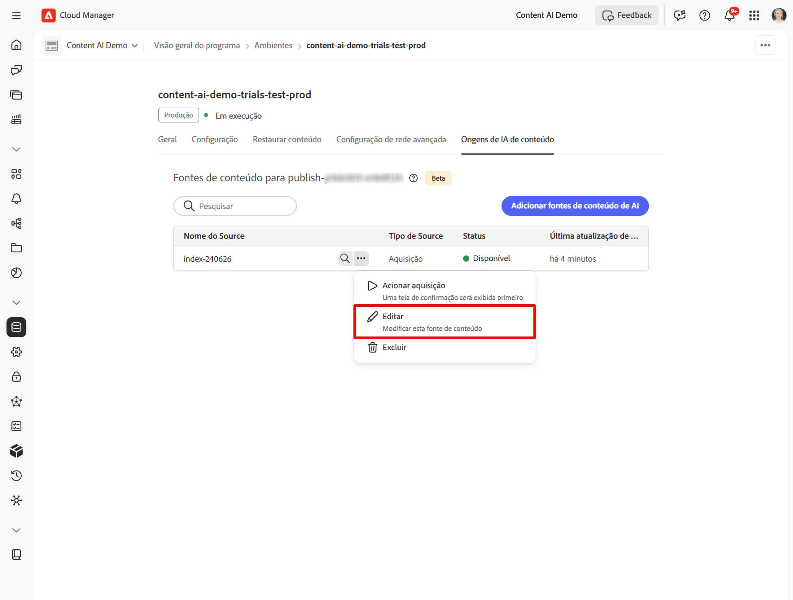

1. Na caixa de diálogo **[!UICONTROL Modificar fonte da IA de conteúdo]**, atualize o campo **[!UICONTROL Descrição]**, **[!UICONTROL Endereço do site]**, **[!UICONTROL Excluir URLs]** ou **[!UICONTROL Frequência de atualização]**, conforme necessário. O **[!UICONTROL Nome da configuração da IA de conteúdo]** é somente leitura e não pode ser alterado.

   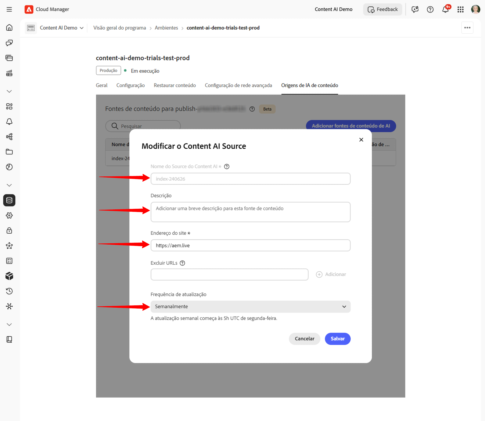

1. Selecione **[!UICONTROL Salvar]** para aplicar as alterações. A lista de fontes é atualizada para refletir suas alterações.

### Excluir uma origem {#delete}

1. Na lista de origem, selecione o ícone **mais ações** (...) ao lado da origem e selecione **[!UICONTROL Excluir]**.

   >[!WARNING]
   >
   >A exclusão de uma fonte é permanente. Todo o conteúdo indexado para essa fonte é removido e não pode mais atender às consultas de pesquisa.

Após a exclusão, a origem não aparecerá mais na lista.

## Próximas etapas {#next-steps}

* [Configurar um projeto no Adobe Developer Console](setup-adc-project.md) - Crie o projeto no ADC e as credenciais necessárias para chamar a API.
* [Referência da API da IA de conteúdo](https://developer.adobe.com/experience-cloud/experience-manager-apis/api/experimental/contentai/) - Consulte seu conteúdo indexado usando pontos de acesso de pesquisa semântica, de texto completo ou híbrida.

## Resolução de problemas {#troubleshooting}

* **A fonte permanece na [!UICONTROL Indexação] por um período estendido.** Tente realizar a aquisição novamente no menu (...). Se o status não avançar após uma segunda execução, verifique se o **[!UICONTROL endereço do site]** pode ser acessado publicamente e se os padrões **[!UICONTROL Excluir URLs]** não filtram todas as páginas.
* **A fonte retorna para [!UICONTROL Novo] após uma execução.** O rastreador não pôde buscar nenhuma página do URL raiz configurado. Confirme se o URL responde com `200 OK` e se o site não está bloqueando solicitações automatizadas.
* **[!UICONTROL Pesquisar] não retorna resultados para uma fonte [!UICONTROL Disponível].** Indexação bem-sucedida, mas nenhum conteúdo corresponde à consulta. Tente uma consulta mais ampla ou verifique se os URLs rastreados incluem as páginas esperadas.
