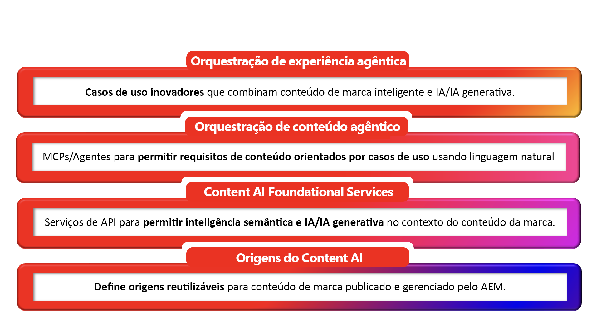

# IA de conteúdo do AEM – Uma introdução

## Conteúdo inteligente, pronto para IA desde a concepção {#ai-ready}

Os clientes estão começando a conhecer marcas por meio da IA antes de conhecerem um site. Assistentes de bate-papo, visões gerais de IA, agentes, pesquisa conversacional, Concierges de IA — todos eles recuperam, resumem e representam o conteúdo da marca em nome da marca. O que eles dizem é apenas tão preciso, atual e sobre a marca quanto o conteúdo que podem alcançar.
É o deslocamento para o qual a IA de conteúdo do AEM é criada. Ele trata o conteúdo da marca como a verdade fundamental sobre a qual as experiências de IA são executadas - e fornece aos clientes do AEM as ferramentas para criar essa verdade fundamental mais rapidamente do lado do autor e fornecê-la claramente às experiências orientadas por IA voltadas para o consumidor no lado da publicação.

**No lado do autor**, a IA de conteúdo do AEM fundamenta a criação em fontes aprovadas pela marca. A criação assistida por IA, a descoberta em linguagem natural pelo conteúdo, fragmentos e ativos de página existentes, e a geração com reconhecimento de marca permitem que as equipes produzam variações para novos públicos, regiões e canais sem sair do AEM e sem se desviar do que já foi aprovado.

**No lado da publicação**, o mesmo conteúdo é estruturado, gerenciado e indexado para ser utilizado pela IA. Fragmentos, metadados, taxonomias e fontes aprovadas são expostos em formas que os sistemas de recuperação, os agentes e as interfaces de conversação podem usar com confiança; portanto, quando a IA fala pela marca, ela fala a verdade da marca.

### O que isso significa para os clientes do AEM {#what-it-means}

O conteúdo aprovado é a defesa da marca contra alucinações. Quando a IA é fundamentada em conteúdo AEM controlado, as respostas permanecem precisas, atuais e sobre a marca por padrão.
A criação acompanha a demanda da era da IA. As equipes geram cópias e imagens para mais públicos-alvo e momentos dentro da experiência de criação, extraindo de fontes aprovadas em vez de começar em branco.
A descoberta funciona da maneira que as pessoas e as máquinas realmente perguntam. A pesquisa em linguagem natural e baseada em intenções entre ativos, fragmentos, páginas e formulários transforma o conteúdo existente em um suprimento reutilizável.
O Personalization pode ser dimensionado por meio de reutilização, não de duplicação. Os componentes controlados são recombinados em variantes em vez de se multiplicarem em cópias não rastreadas.
Os canais de publicação agora incluem superfícies de IA. O conteúdo é fornecido em formas que seres humanos, agentes e experiências mediadas por IA podem consumir - sem pipelines separados para cada um.

**O maior ponto: o conteúdo de marca confiável existente é mais valioso agora do que nunca. Cada fragmento, ativo e página aprovado que já está no AEM se torna a verdade básica da qual as experiências orientadas por IA dependem. A IA de conteúdo do AEM é o que torna essa biblioteca reutilizável, detectável e pronta para potencializar o que vem a seguir.**

## Visão geral da IA de conteúdo do AEM {#at-a-glance}

A IA de conteúdo do AEM é estruturada como uma pilha de quatro camadas — cada camada se apoia na anterior, partindo do conteúdo confiável na base até as experiências agênticas que ela viabiliza no topo.

*Leia a pilha de baixo para cima - desde o conteúdo confiável na base até as experiências agênticas que ele alimenta no topo.*

1. Fontes da IA de conteúdo
As Fontes de conteúdo são entidades gerenciadas na IA de conteúdo do AEM que se conectam a um corpo de conteúdo confiável. Uma fonte de conteúdo pode fazer referência a um tipo de conteúdo governado pelo AEM, como ativos, fragmentos de conteúdo, páginas, formulários, metadados e taxonomias, bem como fontes que não sejam do AEM, como sites de terceiros, bases de conhecimento ou portais de documentação. Cada fonte de conteúdo é automaticamente vetorizada e enriquecida semanticamente para possibilitar experiências de IA voltadas para a recuperação de informações, contextualização e conversação. Defina as fontes de conteúdo uma única vez e reutilize-as em todas as APIs de IA de conteúdo, com atualizações automáticas e verificação de atualizações integradas.

1. Serviços básicos de IA de conteúdo
As APIs e os serviços que permitem inteligência semântica e IA generativa no contexto do conteúdo da marca. Trabalhando com base nas Fontes de IA de conteúdo, esses serviços potencializam a recuperação, a geração, a variação com reconhecimento de marca e a otimização - tudo isso com base no conteúdo aprovado do cliente.

1. Orquestração agêntica de conteúdo
MCPs e agentes que transformam requisitos de conteúdo orientados por casos de uso em ação coordenada por meio da linguagem natural. Essa camada permite que autores e outros agentes descrevam o que precisam em linguagem simples e que os serviços essenciais certos sejam orquestrados para cumpri-la.

1. Orquestração agêntica de experiência
Os casos de uso inovadores que surgem quando o conteúdo inteligente da marca atende à IA em grande escala. As próprias soluções do AEM baseiam-se nesses serviços essenciais — e os clientes podem usar as mesmas APIs diretamente para criar suas próprias experiências agênticas em relação ao seu próprio conteúdo. De cadeias de fornecimento de conteúdo alimentado por IA a jornadas de conversação de usuários, essa camada é onde o conteúdo governado se torna uma vantagem competitiva.

Essas camadas são conectadas por design: cada serviço de IA tem base na base de conteúdo e tudo o que é produzido retorna ao mesmo sistema governado. Portanto, a criação do lado do autor e a entrega do lado da publicação compartilham uma fonte de verdade.

## IA de conteúdo do AEM em ação {#action}

A integração de uma IA de conteúdo funcional envolve duas tarefas:

### &#x200B;1. Habilitar a IA de conteúdo para o ambiente do AEM {#enable}

**Pré-requisito:** antes de começar a usar a IA de conteúdo, você precisa de credenciais de API com escopo para o seu ambiente do AEM as a Cloud Service. Consulte [Configurar um projeto do Adobe Developer Console](setup-adc-project.md).

### &#x200B;2. Controle suas fontes de IA de conteúdo {#control}

Configure e gerencie suas Fontes de IA de conteúdo para habilitar experiências baseadas em IA. Consulte [Controlar suas Fontes de conteúdo](contentsources.md) para obter mais informações.

## Conheça as APIs da IA de conteúdo  {#apis}

Explore a amplitude funcional da IA de conteúdo do AEM - as APIs mostram todo o potencial da plataforma. Consulte [APIs de IA de conteúdo](https://developer.adobe.com/experience-cloud/experience-manager-apis/api/experimental/contentai/).
