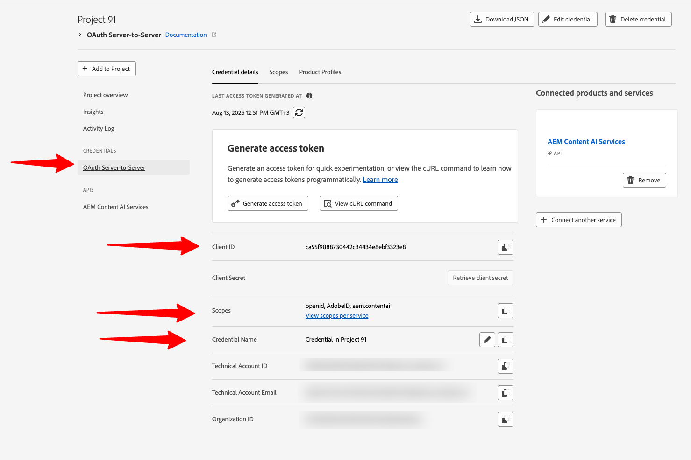
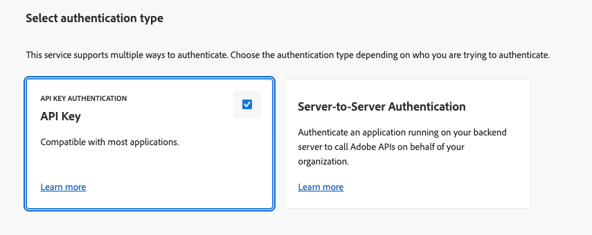

# Configurar um projeto do Adobe Developer Console {#configure-adc-project}

Para chamar a API dos Serviços de IA de conteúdo da AEM, você precisa de credenciais emitidas por um projeto do Adobe Developer Console (ADC). Esta página orienta você na criação do projeto, na seleção de um método de autenticação e na geração da credencial incluída em cada solicitação de API.

Vá para o [Adobe Developer Console](https://developer.adobe.com/console/) para iniciar sua organização.

## Pré-requisitos {#prerequisites}

Antes de começar, verifique o seguinte:

* Você tem acesso ao [Adobe Developer Console](https://developer.adobe.com/console/) para sua organização.
* Você foi adicionado como um **Desenvolvedor** no perfil de produto dos Serviços de IA de Conteúdo da AEM no **Adobe Admin Console**. Sem essa função, o cartão de API dos **[!UICONTROL Serviços AEM Content AI]** aparece desabilitado e a opção de autenticação de **[!UICONTROL Servidor para Servidor]** está oculta.
* Você sabe os números do programa e do ambiente para o perfil de produto que deseja selecionar (por exemplo, `AEM User - publish - Program 12345 - Environment 67890`).
* Você tem a função de **[Administrador do Sistema](https://experienceleague.adobe.com/pt-br/docs/support-resources/adobe-support-tools-guide/adobe-admin-console/admin-roles)** no Admin Console para o programa. Essa função permite gerenciar perfis de produtos e atribuir usuários ao ambiente.

## Escolha um método de autenticação {#choose-auth}

Os Serviços de IA de conteúdo da AEM são compatíveis com dois métodos de autenticação. Escolha o que corresponde à sua integração:

| Método | Melhor para |
| --- | --- |
| [Servidor a servidor](#s2s-auth) | Serviços de back-end que chamam a API sem interação com o usuário. Retorna um token de acesso de vida curta. |
| [Chave de API](#api-key-auth) | Integrações no lado do cliente ou baseadas em navegador que chamam a API diretamente. Retorna uma chave de longa vida com escopo para domínios permitidos. |

## Autenticação de servidor para servidor {#s2s-auth}

1. Selecione **[!UICONTROL APIs e serviços]** e depois **[!UICONTROL APIs]**.

   

1. Filtre por **Serviços de IA de Conteúdo da AEM** e selecione **[!UICONTROL Criar Projeto]** para iniciar um novo projeto ou **[!UICONTROL Adicionar API]** se estiver adicionando o serviço a um projeto existente.

   >[!NOTE]
   >
   >Se o cartão de API for desativado com uma mensagem &quot;Licença necessária&quot;, o ambiente do AEM as a Cloud Service pode não ser modernizado. Consulte [Modernização do ambiente do AEM as a Cloud Service](https://experienceleague.adobe.com/pt-br/docs/experience-manager-learn/cloud-service/aem-apis/openapis/setup#modernization-of-aem-as-a-cloud-service-environment).

1. Na caixa de diálogo **[!UICONTROL Configurar API]**, selecione a autenticação de **[!UICONTROL Servidor para Servidor]**.

   

   >[!TIP]
   >
   >Se a opção de servidor para servidor não estiver disponível, o usuário que está configurando a integração não será adicionado como Desenvolvedor ao Perfil do produto. Consulte [Habilitar autenticação de Servidor para Servidor](https://developer.adobe.com/developer-console/docs/guides/authentication/ServerToServerAuthentication/implementation).

1. Se necessário, renomeie a credencial. Selecione **[!UICONTROL Próximo]**.

   

1. Selecione o **[!UICONTROL Usuário do AEM - publicar - Programa XXX - Ambiente XXX]** e/ou o **[!UICONTROL Usuário do AEM - autor - Programa XXX - Ambiente XXX]** Perfil do Produto e selecione **[!UICONTROL Salvar]**.

   

1. Revise a configuração da API e da autenticação.

   

   

### Gerar um token de acesso {#generate-token}

1. No projeto ADC, vá para **[!UICONTROL Credenciais]** e selecione **[!UICONTROL Gerar token de acesso]**.

   

1. Incluir o token no cabeçalho `Authorization` de cada solicitação de API:

   ```http
   Authorization: Bearer YOUR_ACCESS_TOKEN
   ```

   >[!WARNING]
   >
   >Armazene o token com segurança. Ele expira e deve ser regenerado periodicamente.

## Autenticação da chave de API {#api-key-auth}

1. Ao adicionar a API dos Serviços de IA de conteúdo da AEM ao seu projeto, selecione **[!UICONTROL Chave da API]** na caixa de diálogo **[!UICONTROL Selecionar tipo de autenticação]**.

   

1. Confirme a credencial da chave de API.

   

1. Para restringir quais origens podem usar a chave, configure os domínios permitidos.

   

1. Sua Chave de API (ID do Cliente) aparece em **[!UICONTROL Credenciais conectadas]**. Selecione **[!UICONTROL Copiar]**.

   

1. Inclua a chave em cada solicitação de API:

   ```http
   x-api-key: YOUR_API_KEY
   ```

   Seu projeto está pronto. Use a chave em cada solicitação para acessar os Serviços de IA de conteúdo da AEM.

## Próximas etapas {#next-steps}

* [Controlar Fontes de Conteúdo](contentsources.md) - Configure uma fonte de conteúdo no Cloud Manager e acione a aquisição.
* [Referência da API da IA de conteúdo](https://developer.adobe.com/experience-cloud/experience-manager-apis/api/experimental/contentai/) - Use seu token de acesso ou chave de API para consultar o conteúdo indexado.
